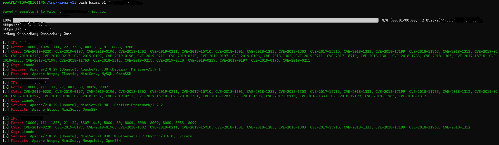

<a href="https://www.buymeacoffee.com/medheeraj"></a>


## Description
**KARMA_v1**
is a simple bash script automation that can talk to [Shodan](https://shodan.io) Premium API and find active IPs, ASN, Common Vulnerabilities, CVEs &amp; Open Ports. 

**This VERSION (karma_v1) limit to 1000 IPs/Results only**

***Its (karma_v1) a bit slow due to shodan API rate limit.***

#### Installation

```shell
git clone https://github.com/Dheerajmadhukar/karma.git
pip3 install shodan
apt install jq -y
````

**Usage**
```
# cat > .token
<SHODAN_PREMIUM_API_HERE>

# bash karma_v1 target.tld

Output will be saved in output/target.tld-YYY-MM-DD directory
```
<h1 align="left">
  </a>
  <br>
</h1>

Some example usage:

```shell
# bash karma_v1 target.tld

##### Requirements
- shodan python module [ pip3 install shodan ]
- jq [ apt install jq -y ]
- httpx [@pdiscoveryio](https://github.com/projectdiscovery/httpx)
